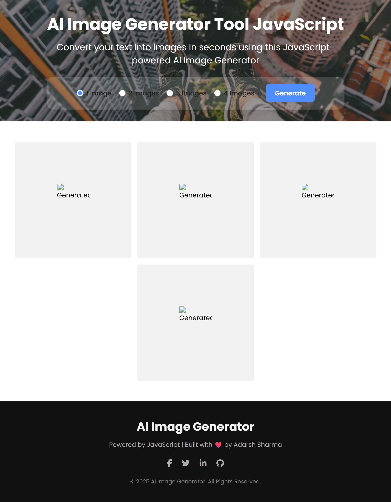

# 🧠 AI Image Generator 🎨

This is a sleek, responsive AI Image Generator built using **HTML**, **CSS**, and **JavaScript**. Users can input a text prompt and generate realistic images using an AI API (like OpenAI's DALL·E). The app supports choosing 1-4 images, dynamic rendering, and downloading generated images with a click.

## 🔥 Live Demo

*(https://ai-image-generation-lemon.vercel.app/)* 

---

## 📸 Preview



---

## 🚀 Features

- 🎨 Generate AI images from text prompts
- 🖼️ Choose number of images (1-4)
- 💾 Download images with one click
- 📱 Fully responsive layout
- ⚡ Fast and lightweight interface
- 🖤 Footer with social links and dynamic year

---

## 🛠️ Technologies Used

- HTML5
- CSS3 (Flexbox, Responsive Design)
- JavaScript (DOM manipulation, async API calls)
- Font Awesome (Icons)

---

## 📦 Installation

Clone this repo and open `index.html` in your browser:

```bash
git clone https://github.com/yourusername/ai-image-generator.git
cd ai-image-generator
open index.html
